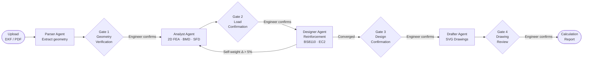
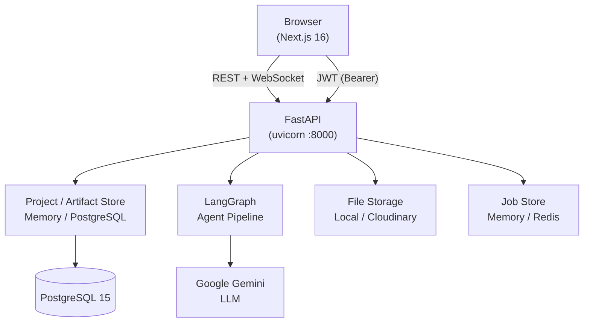

# StructAI Copilot

An open-source, AI-driven structural engineering IDE that automates the full RC design pipeline — from architectural drawings to reinforcement schedules and production drawings — with a human engineer confirming every major decision before the pipeline advances.

---

## What It Does

StructAI Copilot ingests a DXF or PDF architectural drawing, extracts the structural geometry, runs finite element analysis, designs reinforcement to BS8110 or Eurocode 2, and generates RC drawings and calculation reports. A multi-agent LangGraph pipeline orchestrated by Google Gemini drives the process; four hard-stop safety gates require explicit engineer confirmation before each stage can proceed.

Every gate approval freezes an immutable, authored, timestamped **artifact** — building an auditable trail of exactly what was signed off, when, and by whom.

---

## The Pipeline



Each gate is a hard stop. The backend returns `403 GATE_NOT_PASSED` if any downstream endpoint is called before the upstream gate is confirmed.

---

## System Architecture



### Pluggable, memory-first storage

Every external dependency sits behind a swappable store with a memory backend, so the app — and the entire test suite — boots with **no database, Redis, or cloud storage** required. Opt into the persistent backend per store by setting the relevant environment variable:

| Store | Memory backend (default) | Persistent backend | Selector |
|---|---|---|---|
| Projects | in-process | PostgreSQL | `PROJECT_STORE_BACKEND` (`memory` \| `postgres`) |
| Artifacts (gate snapshots) | in-process | PostgreSQL | follows `PROJECT_STORE_BACKEND` |
| Async jobs | in-process | Redis (auto when `REDIS_URL` set) | `JOB_STORE_BACKEND` (`memory` \| `redis`) |
| Files | local disk | Cloudinary | `FILE_STORAGE_BACKEND` (`local` \| `cloudinary`) |

> **Local/dev defaults to memory; deploys run on Postgres.** When
> `PROJECT_STORE_BACKEND=postgres` (set with `DATABASE_URL`), projects and gate
> artifacts persist **and** the LangGraph pipeline checkpointer switches from
> `MemorySaver` to `AsyncPostgresSaver` (wired in `main.py`'s lifespan), so
> in-flight pipeline state survives restarts. In deployed environments the schema
> is **migration-managed** — run `alembic upgrade head` (the Docker Compose `api`
> service does this automatically before starting). The bundled `docker-compose.yml`
> ships this durable configuration out of the box.

---

## Tech Stack

| Layer | Technology |
|---|---|
| Frontend | Next.js 16 (App Router), React 19, TypeScript, Tailwind CSS 4 |
| State | Zustand 5, TanStack Query 5, Axios |
| Backend | FastAPI 0.135, Python 3.12, Uvicorn |
| Agents | LangGraph 1.1, LangChain, Google Gemini |
| Database | PostgreSQL 15, SQLAlchemy 2.0 async, Alembic |
| Auth | fastapi-users 15, JWT, Google OAuth, email 2FA (Resend) |
| File parsing | ezdxf (DXF), PyMuPDF (PDF) |
| Design codes | BS8110-1997, Eurocode 2 (EN 1992-1-1) |
| File storage | Local filesystem or Cloudinary |
| Job store | In-memory or Redis |
| Containerisation | Docker, Docker Compose |

---

## Repository Structure

```
design-suite/
├── apps/
│   ├── api/          # FastAPI backend — see apps/api/README.md
│   └── web/          # Next.js frontend — see apps/web/README.md
├── docs/             # Architecture and domain documentation
├── guides/           # User-facing workflow guides
├── sample/           # Sample DXF/PDF projects for testing
└── docker-compose.yml
```

---

## Quickstart (Docker Compose)

### Prerequisites

- [Docker](https://docs.docker.com/get-docker/) and Docker Compose
- A [Google Gemini API key](https://aistudio.google.com/app/apikey)
- A [Resend](https://resend.com) account for email (registration verification, 2FA)
- A [Google OAuth app](https://console.cloud.google.com/) (optional — for social login)

### 1. Clone the repository

```bash
git clone https://github.com/ade-yem/design-suite.git
cd design-suite
```

### 2. Configure environment

Create `apps/api/.env` from the example and fill in the required values:

```bash
cp apps/api/.env.example apps/api/.env
```

At minimum, set:

```env
SECRET_KEY=<a-long-random-string>
DATABASE_URL=postgresql+asyncpg://user:password@db:5432/design_suite
GEMINI_API_KEY=<your-gemini-api-key>
RESEND_API_KEY=<your-resend-api-key>
SENDER_EMAIL=noreply@yourdomain.com
```

See [apps/api/README.md](apps/api/README.md#environment-variables) for the full variable reference.

### 3. Start all services

```bash
docker-compose up -d
```

This starts three containers:

| Service | URL | Description |
|---|---|---|
| `web` | http://localhost:3000 | Next.js frontend |
| `api` | http://localhost:8000 | FastAPI backend |
| `api` docs | http://localhost:8000/api/docs | Swagger UI |
| `db` | localhost:5432 | PostgreSQL 15 |

### 4. Run database migrations

```bash
docker-compose exec api alembic upgrade head
```

### 5. Open the app

Navigate to http://localhost:3000, register an account, and create your first project.

---

## Development (Without Docker)

For local development with hot-reload on both apps:

- **Backend:** See [apps/api/README.md](apps/api/README.md) — uvicorn with `--reload`
- **Frontend:** See [apps/web/README.md](apps/web/README.md) — Next.js with Turbopack

---

## Contributing

We welcome contributions — bug fixes, design-code implementations, new member types, frontend improvements, and documentation.

### Getting started

1. Fork the repository and create a branch from `main`:
   ```bash
   git checkout -b feat/your-feature-name
   ```
2. Set up both apps locally (see each app's README).
3. Make your changes, write or update tests.
4. Run the test suite before opening a PR:
   ```bash
   # Backend — runs fully in-memory, no database or API keys needed
   cd apps/api && pytest

   # Frontend
   cd apps/web && npm run lint && npm run build
   ```
   The backend suite mocks all Gemini calls and forces memory-backed stores via `tests/conftest.py`, so it runs offline. The same checks run in CI on every push (`.github/workflows/ci.yml`).
5. Open a pull request with a clear description of what changed and why.

### Code conventions

- **Backend:** Follow the `router → service → core` layering. Business logic belongs in `core/`; routers handle HTTP only.
- **Frontend:** Components in `src/components/`, server state in TanStack Query, client state in Zustand stores.
- **Units (enforced globally):** forces in kN, moments in kNm, lengths in m (section dimensions in mm), stresses in MPa, reinforcement areas in mm².

---

## License

[MIT](LICENSE)
