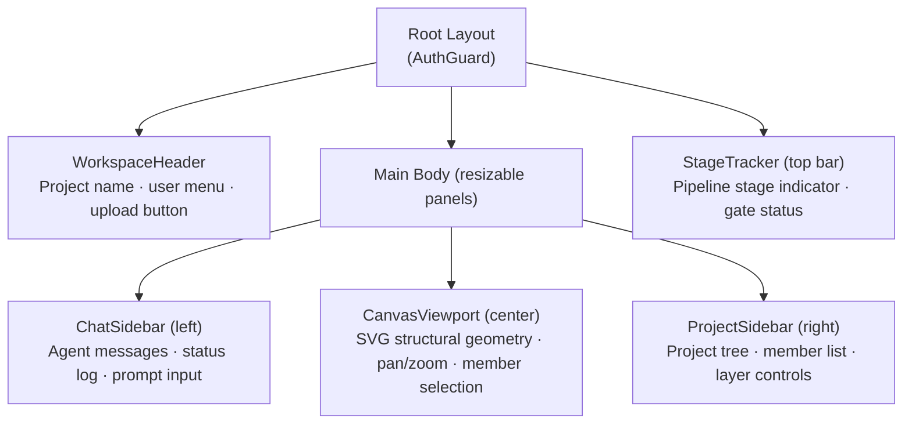

# Design Suite — Web

The Next.js frontend for Design Suite. It provides a structural engineering workspace: an SVG canvas for visualising and interacting with structural geometry, a chat sidebar for following the AI agent pipeline in real time, a project sidebar for managing members, and a stage tracker that shows where the project sits in the four-gate pipeline.

---

## Contents

- [Tech Stack](#tech-stack)
- [Prerequisites](#prerequisites)
- [Local Development](#local-development)
- [App Structure](#app-structure)
- [Pages](#pages)
- [Key Components](#key-components)
- [Canvas System](#canvas-system)
- [State Management](#state-management)
- [API Integration](#api-integration)
- [Authentication](#authentication)
- [WebSocket Integration](#websocket-integration)
- [Building for Production](#building-for-production)
- [In Progress](#in-progress)

---

## Tech Stack

| Concern | Library | Version |
|---|---|---|
| Framework | Next.js (App Router) | 16.0.6 |
| UI | React | 19.2.0 |
| Language | TypeScript | 5 |
| Styling | Tailwind CSS | 4 |
| Server state | TanStack Query | 5.96.2 |
| Client state | Zustand | 5.0.13 |
| HTTP client | Axios | 1.16.1 |
| Forms | React Hook Form + Zod | 7.72 / 4.3 |
| UI primitives | Radix UI | — |
| Icons | Lucide React | 1.7.0 |
| Charts | Recharts | 3.8.1 |
| Notifications | Sonner | 2.0.7 |
| Layout | react-resizable-panels | 4.9.0 |
| Package manager | pnpm | — |

---

## Prerequisites

- Node.js 20+
- pnpm (`npm install -g pnpm`)
- The Design Suite API running at `http://localhost:8000` (see [apps/api/README.md](../api/README.md))

---

## Local Development

### 1. Install dependencies

```bash
cd apps/web
pnpm install
```

### 2. Configure the API base URL

The frontend expects the API to be running at `http://localhost:8000`. If yours is on a different host or port, update the `baseURL` in `src/lib/api.ts`.

### 3. Start the development server

```bash
pnpm dev
```

The app runs at http://localhost:3000 with hot-reload via Turbopack.

### Linting

```bash
pnpm lint
```

---

## App Structure

```
src/
├── app/                    # Next.js App Router — pages and layouts
├── components/             # React components
│   ├── canvas/             # Canvas viewport and tools
│   ├── auth/               # Auth-specific components
│   └── *.tsx               # Shared workspace components
├── hooks/                  # Custom React hooks
├── lib/                    # API client, utilities, canvas helpers
├── stores/                 # Zustand client state stores
└── types/                  # TypeScript domain types
```

### Workspace layout



---

## Pages

### Authenticated (protected by `AuthGuard`)

| Route | Description |
|---|---|
| `/` | Main engineering workspace — canvas, sidebars, stage tracker |
| `/profile` | User profile and settings |

### Unauthenticated

| Route | Description |
|---|---|
| `/login` | Email + password login; 2FA OTP prompt if enabled |
| `/register` | Account registration; triggers email verification |
| `/verify` | Email verification via token link |
| `/verify-pending` | "Check your inbox" holding page after registration |
| `/forgot-password` | Request a password reset email |
| `/reset-password` | Set a new password using the reset token |
| `/auth/callback` | Google OAuth redirect target — exchanges code for JWT |

`AuthGuard` wraps the root layout. It reads auth state from Zustand and redirects unauthenticated users to `/login`.

---

## Key Components

### `CanvasViewport` (`components/canvas/CanvasViewport.tsx`)

The central workspace pane. Renders structural geometry onto an HTML5 Canvas element using a set of canvas helper modules:

- `drawGrid` — background grid with configurable snap
- `drawMembers` — draws beams, columns, slabs as vector geometry from `parsedGeometry`
- `drawLabels` — member IDs and dimension annotations
- `hitTest` — determines which member the pointer is over for selection

Supports pan (mouse drag), zoom (scroll wheel), and member selection (click). The selected member is synced with `canvasStore` and reflected in `PropertyInspector` and `ProjectSidebar`.

### `ChatSidebar` (`components/ChatSidebar.tsx`)

Left panel showing the live agent conversation and status log. Displays `AIMessage` and `HumanMessage` entries from the agent pipeline, along with structured status log entries (agent name, timestamp, outcome). Includes `ProjectPrompt` for the engineer to send messages to the agent.

> **Note:** WebSocket integration is in progress (see [In Progress](#in-progress)). The sidebar currently renders messages from the Zustand store but does not yet connect a live WebSocket.

### `ProjectSidebar` (`components/ProjectSidebar.tsx`)

Right panel listing the active project's structural members grouped by type (beams, columns, slabs, etc.). Clicking a member selects it in `canvasStore`, which highlights it on the canvas and opens its properties in `PropertyInspector`.

### `StageTracker` (`components/StageTracker.tsx`)

Top bar showing the five pipeline stages (upload → verify → analyse → design → draft) and which gates have been confirmed. Stages are derived from `project.pipeline_status`.

### `WorkspaceHeader` (`components/WorkspaceHeader.tsx`)

Top bar with the project name and reference, a file upload trigger (opens `CanvasUploader`), and a user menu (profile, logout).

### `NewProjectModal` (`components/NewProjectModal.tsx`)

Dialog for creating a project. Fields: name, reference, client, and design code (BS8110 or EC2). Submits to `POST /api/v1/projects/`.

### `CanvasUploader` (`components/canvas/CanvasUploader.tsx`)

File picker for DXF (required) and reference PDF (optional). Submits to `POST /api/v1/files/upload/{project_id}` and polls the returned job ID until parsing is complete.

### `PropertyInspector` (`components/canvas/PropertyInspector.tsx`)

Panel that shows and allows editing of the selected member's design parameters (e.g., section dimensions, concrete grade). Calls `PUT /api/v1/design/{project_id}/member/{member_id}` to re-check limit states after a change.

### `GeometryVerificationBar` (`components/canvas/GeometryVerificationBar.tsx`)

Overlay rendered on the canvas after parsing completes. Lets the engineer confirm or correct the parsed geometry before the pipeline advances past Gate 1 (`PUT /api/v1/files/{project_id}/verify`).

### `AuthGuard` (`components/AuthGuard.tsx`)

Wraps the root layout. Reads `isAuthenticated` from `authStore`. If the user is not authenticated, redirects to `/login`. If authenticated, renders children.

---

## Canvas System

The canvas rendering pipeline is in `src/lib/canvas/`:

| Module | Responsibility |
|---|---|
| `drawGrid.ts` | Renders the background grid; respects snap and zoom level |
| `drawMembers.ts` | Renders beams (lines), columns (rectangles), slabs (filled polygons) from `StructuralMember` geometry |
| `drawLabels.ts` | Renders member IDs and dimension text at correct canvas coordinates |
| `hitTest.ts` | Given a pointer position, returns the `member_id` of the member under the cursor (or null) |
| `transform.ts` | Converts between world coordinates (metres) and canvas pixel coordinates; handles pan and zoom |

Coordinate system: the structural model uses metres (x right, y up). The canvas uses pixels (x right, y down). `transform.ts` handles the flip and scaling.

---

## State Management

The frontend uses **Zustand** for client-side state and **TanStack Query** for server-side caching. They are separate concerns — Zustand for auth, canvas, and UI state; TanStack Query for project and member data fetched from the API.

### `authStore` (`stores/authStore.ts`)

Persisted to `localStorage` under the key `copilot-auth-session`.

| State field | Type | Description |
|---|---|---|
| `user` | `UserProfile \| null` | Current user profile |
| `token` | `string \| null` | JWT access token |
| `organisation` | `OrganisationInfo \| null` | User's organisation |
| `isAuthenticated` | `boolean` | Derived from `token !== null` |
| `is2faRequired` | `boolean` | True if waiting for OTP input |
| `pendingUserId`, `pendingEmail` | `string` | 2FA challenge context |

Key actions: `setAuth(user, token, org)`, `set2faChallenge(userId, email)`, `clearAuth()`.

### `projectStore` (`stores/projectStore.ts`)

| State field | Description |
|---|---|
| `activeProject` | The currently open `Project` entity |
| `members` | List of `ProjectMember` records |
| `parsedGeometry` | Raw parsed structural JSON from the API |
| `loadingDefinition` | Current load definition |
| `analysisResults` | FEA results per member |
| `designResults` | Reinforcement schedule per member |

### `canvasStore` (`stores/canvasStore.ts`)

| State field | Description |
|---|---|
| `viewport` | `{panX, panY, zoom}` — current canvas view transform |
| `selectedMembers` | Set of selected `member_id` strings |
| `layers` | Layer definitions (id, label, member_type, visible, color) |
| `hoverMember` | `member_id` under the pointer |
| `gridSnap` | Whether snap-to-grid is enabled |

Key actions: `pan(dx, dy)`, `zoom(delta, origin)`, `selectMember(id)`, `toggleMemberVisibility(id)`.

### `uiStore` (`stores/uiStore.ts`)

Ephemeral UI state: `showNewProjectModal`, `showUploadPrompt`, `sidebarWidth`. No persistence.

---

## API Integration

The API client is at `src/lib/api.ts`. It is an Axios instance with two interceptors.

### Request interceptor

Reads the JWT token from `authStore.getState().token` and injects it as `Authorization: Bearer <token>` on every request.

### Response interceptor

- **401 responses:** Calls `authStore.getState().clearAuth()` (if a token existed) to end the session, then lets the `AuthGuard` redirect to `/login`.
- **All errors:** Normalises to `ApiError = {status: number, detail: string}`. Extracts `response.data.detail` or falls back to `error.message`.

### Error code mapping

The API returns structured error codes (e.g., `GATE_NOT_PASSED`, `FILE_PARSE_ERROR`). The client maps these to human-readable UI messages via `getFriendlyErrorMessage(detail)`. Some examples:

| Error code | UI message |
|---|---|
| `REGISTER_USER_ALREADY_EXISTS` | "This email address is already associated with an active account." |
| `EMAIL_NOT_VERIFIED` | "Your email address has not been verified yet. Please check your inbox." |
| `INVALID_OR_EXPIRED_CODE` | "The 2FA PIN is invalid or expired. Please log in again." |
| `GATE_NOT_PASSED` | "You must complete the previous step before proceeding." |
| `FILE_PARSE_ERROR` | "Failed to parse the uploaded file. Please ensure it is a valid DXF or PDF." |

---

## Authentication

### Token lifecycle

1. User logs in → JWT stored in `authStore` (Zustand + localStorage)
2. User profile fetched from `GET /api/users/me` and stored in `authStore.user`
3. Every API request carries the token in the `Authorization` header
4. 401 response → `clearAuth()` → redirect to `/login`

### 2FA flow (client side)

1. Login response contains `{status: "two_factor_required", user_id, email}`
2. `is2faChallenge()` type guard detects this shape
3. `authStore.set2faChallenge(user_id, email)` stores the challenge context
4. Login page renders an OTP input
5. User submits 6-digit code → `POST /api/auth/jwt/two-factor-verify`
6. On success, `setAuth()` is called with the real JWT

### Google OAuth flow (client side)

1. `GoogleSsoButton` redirects to `GET /api/auth/google/authorize`
2. User completes Google consent
3. Google redirects to `/auth/callback?code=...&state=...`
4. The callback page sends the code to the backend and receives a JWT
5. `setAuth()` stores the token; user is redirected to `/`

---

## WebSocket Integration

**Status: In progress.**

The backend exposes `ws://host/ws/{project_id}` to stream real-time agent events (message chunks, status logs, gate notifications) to the frontend.

The `ChatSidebar` is designed to consume this stream and render messages as they arrive. This connection is not yet wired end-to-end — the sidebar currently renders messages from the Zustand store but the WebSocket client code is not implemented. Contributions welcome.

When implemented, the expected message shapes from the backend are:

```json
{ "type": "agent_message", "content": "<LLM token chunk>" }
{ "type": "status_log", "tool": "<agent-name>", "status": "complete" }
{ "type": "gate_reached", "gate": "geometry_verification" }
```

---

## Building for Production

### Docker (recommended)

The `Dockerfile` in `apps/web/` is a multi-stage build:

1. **deps** — installs pnpm dependencies
2. **builder** — runs `next build`
3. **runner** — serves the production build as an unprivileged `nextjs` user on port 3000

```bash
# Build the image
docker build -t design-suite-web ./apps/web

# Run standalone
docker run -p 3000:3000 design-suite-web
```

For the full stack, use docker-compose from the repository root.

### Manual build

```bash
cd apps/web
pnpm build
pnpm start          # Serves the production build on :3000
```

---

## In Progress

- **WebSocket:** `ChatSidebar` does not yet connect a live WebSocket to the API — chat messages use Zustand state only
- **CI/CD:** No GitHub Actions pipeline yet — contributions welcome
- **Environment variables:** The API base URL is hardcoded in `src/lib/api.ts`; it should be driven by `NEXT_PUBLIC_API_URL`
- **E2E tests:** No Playwright or Cypress suite yet
