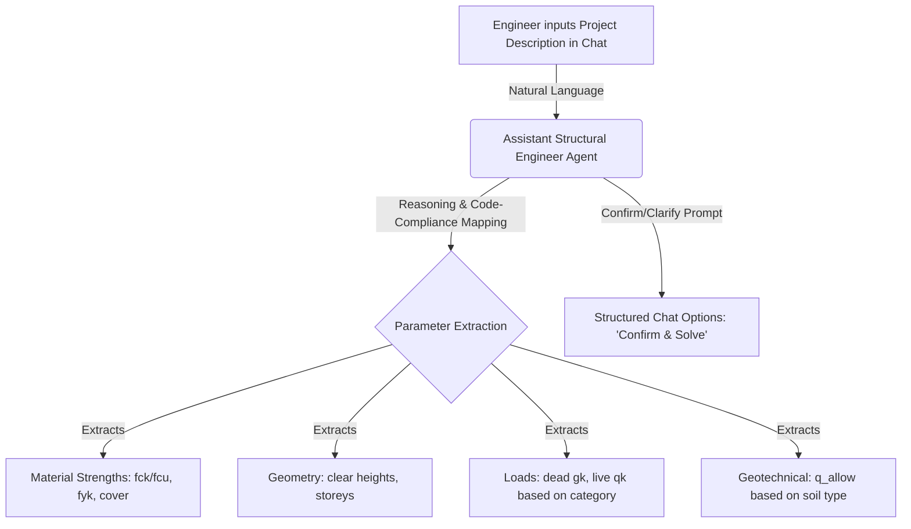
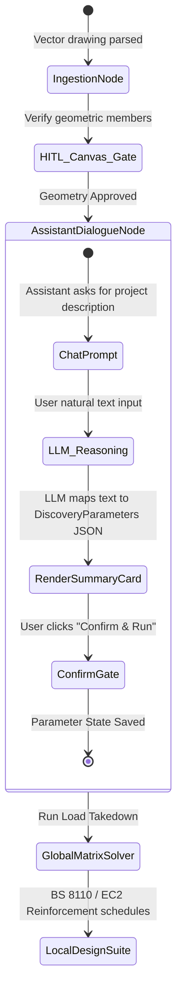

# 💬 Proposal: Reasoning-Based Assistant Structural Engineer Agent

This updated proposal refines the dynamic setup workflow to introduce a **Reasoning-Based Assistant Structural Engineer Agent**. 

Rather than relying on static forms or guided step questions, a **Thinking/Reasoning LLM Model** acts as the engineer's virtual junior structural engineer. Since the **Design Code** (BS 8110 or Eurocode 2) is already chosen during project creation, the Assistant Agent acts as a code-compliant reasoning engine. It conducts a natural dialogue, gathers qualitative project data, and maps it directly to structural, material, loading, and geotechnical parameters.

---

## 1. Architectural Role & Workflow



### The Ingestion Flow:
1. **Context Loading**: The agent loads the active **Design Code** (e.g., Eurocode 2) and the **Parsed Member JSON** as background context.
2. **The Dialogue**: The Assistant Agent asks the engineer to describe the project context (e.g., location/exposure, soil type, building usage, heights, levels).
3. **Reasoning Extraction**: The thinking model parses the natural language, performs structural code lookups (e.g., mapping "Office usage" to $q_k = 3.0\text{ kN/m}^2$ under EC2, or mapping "stiff clay" to safe bearing defaults), and compiles a clean Pydantic parameter schema.
4. **Safety Gate Confirmation**: The Agent prints a beautiful, human-readable summary of identified parameters in the chat with a **[Confirm & Run Analysis]** safety gate button.

---

## 2. Mock Conversational Scenario (Eurocode 2 Project)

* **Design Code Pre-selected**: **Eurocode 2**
* **Parsed Member JSON**: Verified (15 beams, 8 columns parsed from DXF).

### 💬 The Dialogue

> **Assistant Agent**: 
> *"I've analyzed your vector layouts and successfully mapped 15 beams and 8 columns to the interactive canvas!*
> 
> *Since we are designing under **Eurocode 2**, let's lock in the structural criteria. Can you briefly describe the **building's usage**, the **nominal height of each level**, the **soil exposure context**, and any general material details you have?"*

> **Engineer**: 
> *"It's a 3-storey office building in London. Level heights are 3.1 meters clear. Standard C30 concrete and high-yield rebar. The footings are resting on stiff clay, which usually has a capacity of around 150 kPa."*

> **Assistant Agent** *(Reasoning Model Chain)*:
> * *Code selected: Eurocode 2.*
> * *Building usage: "office building" $\rightarrow$ Classifies under EN 1991-1-1 Table 6.1 Category B. Standard imposed load $q_k = 3.0\text{ kN/m}^2$.*
> * *Location: "London/office" $\rightarrow$ Exposure class XC1 (dry/permanently wet). Table 4.4N gives nominal cover $c_{nom} = 30\text{ mm}$ (assuming 50-year service life).*
> * *Clear height: 3.1m $\rightarrow 3100\text{ mm}$ per storey. Column effective heights will defaults to $0.75 \times 3100 = 2325\text{ mm}$ (braced column).*
> * *Materials: "C30 concrete" $\rightarrow$ Cylinder strength $f_{ck} = 30\text{ MPa}$, design strength $f_{cd} = 17.0\text{ MPa}$ ($0.85 \times 30 / 1.5$). "High-yield" $\rightarrow f_{yk} = 500\text{ MPa}$, design strength $f_{yd} = 435\text{ MPa}$.*
> * *Soil: "Stiff clay, 150 kPa" $\rightarrow$ Geotechnical safe bearing capacity $q_{allow} = 150\text{ kPa}$.*

> **Assistant Agent**:
> *"Understood! Based on your description, I have derived the following design parameters aligned with **Eurocode 2** for your review:*
> 
> ### 📋 Derived Project Parameters (EC2)
> 
> | Domain | Parameter | Extracted Value | Derivation Rationale |
> | :--- | :--- | :--- | :--- |
> | **Materials** | Concrete Strength | **C30/37** ($f_{ck} = 30$ MPa) | Standard C30 specification |
> | | Steel Yield ($f_{yk}$) | **500 MPa** | High-yield specification |
> | | Nominal Cover ($c_{nom}$) | **30 mm** | Exposure Class XC1 (Office / Indoor) |
> | **Geometry** | Storey Count | **3 Levels** | Stated count |
> | | Clear Storey Height | **3100 mm** | column buckling $l_0 = 2325$ mm |
> | **Loading** | Dead Load ($g_k$) | **1.5 kN/m²** | Standard office partitions/finishes |
> | | Imposed Load ($q_k$) | **3.0 kN/m²** | EN 1991-1-1 Category B (Offices) |
> | **Soil** | Bearing Capacity | **150 kN/m²** | Stiff clay safe capacity |
> 
> *Everything is synced to your interactive canvas preview. If this looks correct, click below to run global stress envelopes and beam/column reinforcement designs!*
> 
> **`[ ✔️ Confirm & Run Analysis ]`**  **`[ ✏️ Edit Parameters Manual ]`**

---

## 3. Pydantic Parsing Schema (`DiscoveryParameters`)

The reasoning model is instructed to output its final parameter decisions as structured JSON matching this schema:

```python
class DiscoveryParameters(BaseModel):
    """
    Structured project specifications extracted from conversational dialogue.
    """
    # Materials
    concrete_cylinder_fck: float = Field(..., description="Characteristic cylinder compressive strength (N/mm²)")
    steel_yield_fyk: float = Field(500.0, description="Characteristic yield strength of reinforcement (N/mm²)")
    nominal_cover_mm: float = Field(30.0, description="Nominal cover to face of main/link reinforcement (mm)")
    
    # Storeys & Bracing
    num_storeys: int = Field(1, description="Number of floor levels supported")
    storey_height_mm: float = Field(3200.0, description="Clear storey height (mm)")
    is_braced: bool = Field(True, description="True if structure is bracing protected")
    
    # Loading (kPa / kN/m²)
    dead_load_gk_kpa: float = Field(1.5, description="Factored dead load (kN/m²)")
    live_load_qk_kpa: float = Field(3.0, description="Imposed live load (kN/m²)")
    
    # Soil
    bearing_capacity_kpa: float = Field(150.0, description="Geotechnical safe bearing capacity (kN/m²)")
```

---

## 4. Technical Graph Orchestration Flow



---

## 5. Architectural Benefits of a Reasoning Model
* **Engineering Empathy**: Natural conversation mimics real-world interaction between a senior project engineer and a junior engineer/draftsman.
* **Intelligent Derivation**: Eliminates static manual lookups of code category loads (like building usage to exact $q_k$ maps).
* **Adaptable Parsing**: The LLM handles synonyms (e.g. "three floors", "3 storeys", "level height is 3100", "clear span is 3.1 meters") and standardizes them perfectly to millimeters.
