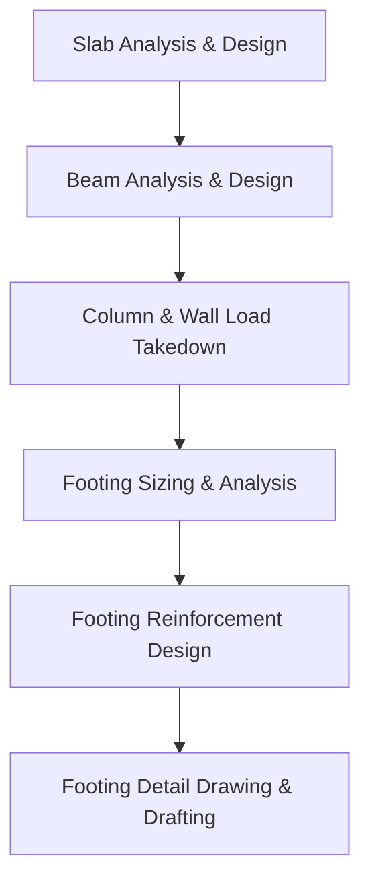

# Technical Audit: Foundation & Footing Integration Pipeline

This document analyzes the current state of footing integration in the **AI-Driven Structural Design Copilot** and details where and how they fit into the end-to-end design pipeline.

---

## 1. Footings in the Design Pipeline Flow

In a standard structural design workflow, footings represent the final boundary support level. They can only be sized and designed once the entire vertical load path has been resolved:

1. **Top-Down Load Accumulation**: Slabs transfer loads to beams; beams transfer reactions to columns/walls; columns/walls accumulate axial forces ($N$) and moments ($M$) storey-by-storey down to the lowest level (level `L01` column bases).
2. **Serviceability Sizing (SLS)**: The accumulated serviceability loads ($N_{sls}$) and soil allowable bearing capacity ($q_a$) are used to size the plan area ($B \times L$) of the pad or combined footing.
3. **Ultimate Strength Design (ULS)**: The ultimate factored load ($N_{uls}$) and moments ($M_{uls}$) determine the contact pressure distribution on the soil. This pressure is then used to design flexural reinforcement, shear capacity, and punching shear resistance.

---

## 2. Current Implementation Audit

### A. What is Already Implemented
1. **Mathematical Solvers**:
   - `PadFootingSolver`, `CombinedFootingSolver`, and `StripFootingSolver` in [footing_solver.py](file:///home/adehnaija/Documents/projects/design-suite/apps/api/core/analysis/footing_solver.py) calculate required footings sizing, contact pressures, design bending moments, and shear forces.
2. **Reinforcement Design Logic**:
   - BS 8110 reinforcement design is implemented in [bs8110/footing.py](file:///home/adehnaija/Documents/projects/design-suite/apps/api/core/design/rc/bs8110/footing.py).
   - Eurocode 2 design checks are implemented in [eurocode2/footing.py](file:///home/adehnaija/Documents/projects/design-suite/apps/api/core/design/rc/eurocode2/footing.py).
3. **API Routing**:
   - Endpoint routers `POST /api/v1/analysis/{project_id}/footing` in [routers/analysis.py](file:///home/adehnaija/Documents/projects/design-suite/apps/api/routers/analysis.py#L270-L291) and `POST /api/v1/design/{project_id}/footing` in [routers/design.py](file:///home/adehnaija/Documents/projects/design-suite/apps/api/routers/design.py#L258-L279) are configured to queue jobs.
4. **Drafting / Detailing**:
   - `FootingDrawingGenerator` is defined in [drawing/footing.py](file:///home/adehnaija/Documents/projects/design-suite/apps/api/core/drawing/footing.py) and registered in [drawing/__init__.py](file:///home/adehnaija/Documents/projects/design-suite/apps/api/core/drawing/__init__.py#L49) under the `"footing_pad"` key.
5. **Web Canvas UI**:
   - The React-based 2D canvas is fully configured to render footings, toggle their labels, inspect properties, and highlight connectivity.

---

### B. Identified Architectural Gaps
1. **No Automatic Parser Extraction**:
   - Although `dxf_parser.py` maps foundation-related layer names to `"foundation_candidate"`, the actual geometry extractor in [extractor.py](file:///home/adehnaija/Documents/projects/design-suite/apps/api/core/parsing/extractor.py) does not process or extract them.
2. **Missing Automated Footing Generation**:
   - There is no generator script that automatically places a footing member at the base of every column/wall at the foundation level.
3. **Design Dispatcher Exclusion**:
   - The concrete member design dispatcher `design_member` in [rc/__init__.py](file:///home/adehnaija/Documents/projects/design-suite/apps/api/core/design/rc/__init__.py#L6-L27) only dispatches `beam`, `column`, and `slab`. It completely skips `footing` members under both design codes.
4. **Disconnected Takedown Inputs**:
   - The `LoadingService` and analysis orchestrator do not automatically link footing solver inputs (`N_sls`, `N_uls`) with the final column base reactions computed during load takedown.

---

## 3. Recommended Integration Plan

To bridge these gaps, footings should be integrated into the pipeline following **Phase 5: Vertical Load Takedown Engine** using this roadmap:

### 1. Auto-Generation of Footings
- **Trigger**: Upon successful completion of the vertical load takedown, the system identifies all ground-level columns (e.g. columns on level `L01` that have no children columns).
- **Action**: Dynamically generate a `footing` member registry in the database (with ID format `F-{ColumnID}`) referencing the column's coordinates and centroid.

### 2. Connect Load Takedown Reactions
- Map the accumulated axial force ($N$) and bending moment ($M$) from the column base directly to the corresponding footing's design loading parameters (`N_sls`, `N_uls`, `M_uls`).

### 3. Update the Design Dispatcher
- Update `design_member` in [rc/__init__.py](file:///home/adehnaija/Documents/projects/design-suite/apps/api/core/design/rc/__init__.py) to import and invoke `design_pad_footing` when the member type is `"footing"`.

### 4. Enable Soil/Geotechnical Prompts
- Trigger the geotechnical parameters questionnaire in the Analyst dialogue once footings are generated, collecting project-wide allowable soil bearing pressure ($q_a$) before running analysis.
