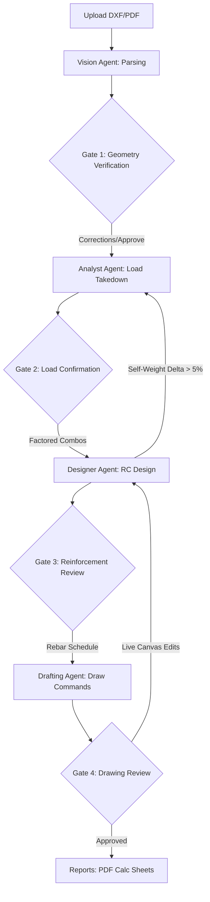

# Master Architecture & Integration Plan: AI-Driven Structural Design Copilot

This document serves as the master engineering blueprint and integration plan for the **AI-Driven Structural Design Copilot**. As the Lead Developer and Project Manager, I have conducted a thorough audit of the backend (`apps/api`) services and routers and the frontend (`apps/web`) React components. 

Below is the comprehensive analysis of existing systems, the integration map, and a phased execution plan to achieve a fully integrated, production-grade **Structural IDE**.

---

## 1. Executive PM Summary
The Structural Design Copilot bridges the gap between architectural vector inputs (DXF/PDF) and finalized structural reinforcement details. By using a **StateGraph-driven LangGraph pipeline** on the backend and a **Side-by-Side Structural IDE** on the frontend, the system allows the AI to run complex calculations and draft designs while giving the human engineer ultimate veto power through **Safety Gates**.



---

## 2. Backend Features & Exposed Endpoints
The backend is powered by **FastAPI** and is highly structured. The domain logic is isolated within the `services/` layer, and orchestration is managed via `LangGraph`.

### 2.1 Core Services Overview
*   **[FileService](file:///home/adehnaija/Documents/projects/design-suite/apps/api/services/files.py):** Single source of truth for DXF/PDF vector data. Owns parsing (via `ezdxf` / `fitz`), unit/scale confirmation, and member coordinates caching.
*   **[LoadingService](file:///home/adehnaija/Documents/projects/design-suite/apps/api/services/loading.py):** Owns superimposed dead and imposed loads. Orchestrates the factored load combination engine (ULS & SLS) per BS 8110 / Eurocode 2 and manages member-level overrides.
*   **[AnalysisService](file:///home/adehnaija/Documents/projects/design-suite/apps/api/services/analysis.py):** Interfaces with the 2D finite element frame matrix solver. Evaluates bending moment diagrams (BMD), shear force diagrams (SFD), and axial forces ($N$).
*   **[DesignService](file:///home/adehnaija/Documents/projects/design-suite/apps/api/services/design.py):** Implements code compliance scripts. Calculates longitudinal rebar areas ($As$), shear link spacing, and tracks convergence loops if self-weight changes during member optimization.
*   **[DrafterService (Agent Node)](file:///home/adehnaija/Documents/projects/design-suite/apps/api/agents/drafter.py):** Converts optimized schedules into drawing primitives (`rect`, `line`, `circle`, `dimension`, `text`) using [BaseDrawingGenerator](file:///home/adehnaija/Documents/projects/design-suite/apps/api/core/drawing/base.py).

### 2.2 Endpoint Registry
All endpoints are prefixed with `/api/v1` and are configured under [main.py](file:///home/adehnaija/Documents/projects/design-suite/apps/api/main.py):

| Service | Method | Route | Description | Safety Gate / Context |
| :--- | :--- | :--- | :--- | :--- |
| **Auth** | `POST` | `/auth/register` | User/Organisation signup | Tenancy isolation |
| | `POST` | `/auth/jwt/login` | Login and acquire token | JWT bearer |
| **Projects** | `POST` | `/projects/` | Create a new project | Set code (BS8110/EC2) |
| | `GET` | `/projects/{project_id}` | Fetch metadata and current stage | Global read |
| **Files & Geometry**| `POST` | `/files/upload/{project_id}` | Upload drawing & start async parser | Background job |
| | `GET` | `/files/{project_id}/parsed` | Retrieve parsed structural JSON | Requires `FILE_UPLOADED` |
| | `PUT` | `/files/{project_id}/scale` | Confirm/Correct unit scale (mm vs m) | Critical for calculations |
| | `PUT` | `/files/{project_id}/verify` | **GATE 1:** Confirm geometry & apply corrections | Advances to `GEOMETRY_VERIFIED` |
| **Loading** | `POST` | `/loading/{project_id}/define` | Define Gk and Qk parameters | Requires `GEOMETRY_VERIFIED` |
| | `POST` | `/loading/{project_id}/combinations` | Compute ULS/SLS load envelopes | **GATE 2:** Advances status |
| **Analysis** | `POST` | `/analysis/{project_id}/run` | Execute 2D Frame Euler-Bernoulli solver | Requires `LOADING_DEFINED` |
| | `GET` | `/analysis/{project_id}/results` | Fetch BMD, SFD, shear/moment values | Global check |
| **Design** | `POST` | `/design/{project_id}/run` | Execute reinforcement suite | Requires `ANALYSIS_COMPLETE` |
| | `GET` | `/design/{project_id}/results` | Fetch rebar spacing & logs | **GATE 3** |
| **Drafting** | `GET` | `/drawings/{project_id}` | Retrieve drafting coordinates package | Requires `DESIGN_COMPLETE` |
| | `PUT` | `/drawings/{project_id}/confirm` | **GATE 4:** Final approval of drawing set | Enters `report_generated` |
| **Orchestration** | `POST` | `/pipeline/{project_id}/run` | Trigger full end-to-end pipeline | LangGraph execution |
| | `POST` | `/pipeline/{project_id}/resume` | Resume pipeline past current active Gate | State recovery |

---

## 3. Frontend Features & Current State
The frontend is a **Next.js 16 (Turbopack) + React 19 + TailwindCSS v4** app located at `apps/web`. A visual inspection of the codebase shows three core components, which currently use mock states:

1.  **[AppHeader.tsx](file:///home/adehnaija/Documents/projects/design-suite/apps/web/src/components/AppHeader.tsx):** Displays the project title and mounts [StageTracker.tsx](file:///home/adehnaija/Documents/projects/design-suite/apps/web/src/components/StageTracker.tsx). Currently hardcoded to `parsing` stage and "Untitled" project.
2.  **[ChatSidebar.tsx](file:///home/adehnaija/Documents/projects/design-suite/apps/web/src/components/ChatSidebar.tsx):** A threaded chat component. Uses standard timeouts to reply with dummy text. Needs to be replaced with WebSocket event streams and interactive action buttons (e.g., "Confirm Geometry" or "Trigger Analysis").
3.  **[CanvasViewport.tsx](file:///home/adehnaija/Documents/projects/design-suite/apps/web/src/components/CanvasViewport.tsx):** Shows a file upload zone. Dragging/dropping a file or clicking "Browse" loads a hardcoded SVG (`DemoGeometry`) that draws six nodes, four beams, and a dimension line in static SVG elements. It contains no zoom, no layer filters, and no click interactions.

---

## 4. Front-to-Back Integration Mapping
To bring the application to life, we must connect the React frontend with the FastAPI backend. Here is the technical integration map:

```
+------------------------------------------------------------+
|                       FRONTEND (Next.js)                  |
|                                                            |
|  +--------------------+  +------------------------------+  |
|  |    Chat Sidebar    |  |       Canvas Viewport        |  |
|  |  - WebSocket logs  |  |  - Dynamic SVG / Scale       |  |
|  |  - Prompt inputs   |  |  - Interactive rebar lines   |  |
|  |  - Resume actions  |  |  - Layer selection panel     |  |
|  +---------+----------+  +--------------+---------------+  |
+------------|----------------------------|------------------+
             | (WS stream)                | (JSON APIs)
             v                            v
+------------|----------------------------|------------------+
|            |            BACKEND         |                  |
|  +---------v----------+  +--------------v---------------+  |
|  | websocket.py       |  | routers/files.py             |  |
|  | routers/pipeline.py|  | routers/drawings.py          |  |
|  +--------------------+  +------------------------------+  |
|                     StateGraph Pipeline                    |
+------------------------------------------------------------+
```

### 4.1 Global State Management
We will introduce a client-side state manager (`Zustand` or a React Context provider) to track:
*   `activeProjectId`: Identifies the loaded project.
*   `pipelineStage`: Current stage (`parsing` | `verification` | `calculation` | `drafting`).
*   `dxfGeometry`: Cached structural JSON of columns and beams.
*   `drawingCommands`: Coordinate arrays for SVG rendering.
*   `selectedMemberId`: Tracks which element is currently highlighted or being edited.
*   `layerVisibility`: Filter states for architectural vs. structural details.

### 4.2 The Canvas Rendering Engine
Instead of utilizing heavy canvas packages, we will replace `DemoGeometry` in `CanvasViewport` with a **Dynamic SVG Canvas**.
*   **Viewport Scaling:** Bind `transform: scale(s) translate(x, y)` to allow smooth panning and zooming.
*   **Commands Parser:** Map coordinate arrays returned by `/drawings/{project_id}` directly into SVG shapes:
    *   `rect` $\rightarrow$ `<rect x={x} y={y} width={w} height={h} className={style} />`
    *   `circle` $\rightarrow$ `<circle cx={cx} cy={cy} r={r} className={style} onClick={() => selectRebar(mark)} />`
    *   `line` $\rightarrow$ `<line x1={x1} y1={y1} x2={x2} y2={y2} strokeWidth={diameter} className={style} />`
    *   `text` $\rightarrow$ `<text x={x} y={y} className={style}>{text}</text>`

### 4.3 Authentication & Tenancy Integration
The backend enforces multi-tenancy isolation using JWT authentication via `fastapi-users`. We must mirror this on the frontend to ensure that structural projects and geometry data remain strictly isolated between different engineering firms (organisations).

*   **JWT Storage & Lifecycle:**
    *   **Acquisition:** The frontend collects credentials and makes a `POST` request to `/auth/jwt/login` with `username` (email) and `password` formatted as `multipart/form-data`.
    *   **Storage:** Store the returned JWT token securely in a client-side auth store (`Zustand` or `localStorage`).
    *   **Inclusion:** Attach the token to the HTTP headers of every subsequent API call: `Authorization: Bearer <token>`.
    *   **Lifecycle Interceptor:** Configure an Axios interceptor to catch any `401 Unauthorized` responses, clear the expired token, and instantly redirect the user to the `/login` portal.
*   **User Profiles & Role-Based Access Control (RBAC):**
    *   Query `/users/me` upon successful authentication to retrieve the user's role (`engineer` | `admin` | `viewer`) and the UUID of their `organisation_id`.
    *   Store this profile information globally. If the user's role is `viewer`, disable direct manipulation on the interactive SVG canvas and hide drawing override options.
*   **Tenancy Enforcement:**
    *   Every project created (`POST /projects/`) automatically registers under the user's `organisation_id` on the database level.
    *   The backend enforces that users can only fetch, modify, or run analysis on projects belonging to their organization. The frontend simply needs to send the token; the backend handles the contextual isolation dynamically.

---

## 5. Detailed Implementation Plan (6 Phases)

### Phase 1: Authentication, Project Selection & Client Setup
**Goal:** Create a secure gateway, load real projects, set up tenancy-aware data fetching, and construct the API client.

*   **Task 1.1: Axios Client & Token Interceptor Setup**
    *   Install Axios and TanStack Query (`@tanstack/react-query`) in `apps/web`.
    *   Initialize an `apiClient` instance in a new utility folder `src/lib/api-client.ts`.
    *   Write a request interceptor that dynamically reads the `auth_token` from local storage and appends it to headers.
    *   Write a response interceptor that automatically intercepts `401` errors, clears the store, and triggers a routing redirect to `/login`.
*   **Task 1.2: Global Auth State & Route Protection**
    *   Create `useAuthStore` with Zustand or React Context to track `isAuthenticated`, `userProfile` (role, email, full_name, organisation_id), and `isLoggingIn`.
    *   Write an `AuthGuard` or `ProtectedRoute` wrapper in the Next.js router. If `isAuthenticated` is false, redirect to `/login`.
*   **Task 1.3: Clean Registration & Login Interface**
    *   Design a premium, sleek login page with outfit typography and glowing subtle gradients.
    *   Login Form: Collect email and password. Use a standard HTML Form element to submit `multipart/form-data` to `/auth/jwt/login`.
    *   Registration Form: Collect full name, email, password, and optionally a pre-assigned `organisation_id` (supporting invite-based onboarding). Post JSON to `/auth/register`.
*   **Task 1.4: Tenancy-Aware Project Selector Modal**
    *   Once authenticated, trigger `GET /projects/` to fetch a list of existing projects belonging to the user's organisation.
    *   Provide a dropdown project selector in `AppHeader.tsx`.
    *   Mount a "New Project" modal. Upon clicking, collect project name, reference, and design code (`"BS8110"` or `"EC2"`), post to `POST /projects/`, update `activeProjectId` globally, and reset the stage tracker to `parsing`.

---

### Phase 2: Live Ingestion & Gate 1 Geometry Verification
**Goal:** Replace dummy upload logic, render the true structural layout, and execute Gate 1 confirmation.

*   **Task 2.1: Chunked File Upload & Polling**
    *   Bind `onDrop` in `CanvasViewport.tsx` to call `POST /files/upload/{project_id}`.
    *   Extract the `job_id` and poll `/files/{project_id}/parse-status/{job_id}` at 1-second intervals.
    *   Display a premium CSS loading bar with detailed step indicators.
*   **Task 2.2: Scale & Geometry Fetching**
    *   On completion, fetch the auto-detected scale (`GET /files/{project_id}/scale`) and structural layout (`GET /files/{project_id}/parsed`).
*   **Task 2.3: Scale Override Form**
    *   Show a banner in the viewport if scale is unconfirmed: *"Scale detected as 1:1000 (mm). Please confirm or correct."*
    *   Submit corrected values via `PUT /files/{project_id}/scale`.
*   **Task 2.4: Render True Geometry**
    *   Draw the actual nodes, beams, and columns fetched from the database on the SVG canvas.
*   **Task 2.5: Safety Gate 1 Action**
    *   Display a floating bar: `[Correct Geometry] [Verify & Lock Layout]`.
    *   Clicking lock triggers `PUT /files/{project_id}/verify` with `confirmed: true` and moves `pipelineStage` to `verification`.

---

### Phase 3: Load Definitions & Gate 2 Loading Integration
**Goal:** Design a beautiful sidebar overlay to define floor actions and trigger ULS/SLS load combinations.

*   **Task 3.1: Superimposed Dead & Imposed load panel**
    *   Create a clean, form-based overlay in the right panel when the pipeline is at the loading stage.
    *   Inputs: Finishes ($kN/m^2$), Screed ($kN/m^2$), partition loads, and a dropdown for Occupancy Category (mapping to characteristic $Qk$).
*   **Task 3.2: Load Ingestion & Engine Run**
    *   Post the configuration payload to `POST /loading/{project_id}/define`.
    *   Call `POST /loading/{project_id}/combinations` to execute the load takedown.
    *   Renders tributary load allocations onto the canvas (e.g., equivalent UDL labels over beams).
*   **Task 3.3: Safety Gate 2 Confirmation**
    *   Enable the "Approve Loads" action which advances the project to `LOADING_DEFINED`.

---

### Phase 4: Multi-Agent Chat Log Stream & WebSockets
**Goal:** Transform the mock chat into a living agent status stream.

*   **Task 4.1: Establish WebSocket Connection**
    *   Connect to `/ws/chat` or the general event router using `useWebSocket` hook in `ChatSidebar.tsx`.
*   **Task 4.2: Stream Message History**
    *   Fetch previous messages on component mount.
    *   Map incoming WebSocket messages to the chat interface. Display typing bubbles when the backend supervisor is working.
*   **Task 4.3: Real-Time Status logs**
    *   Mount an agent status ticker showing detailed calculations (e.g., *"Analyst: Computing moment envelopes... [98%]"*).
*   **Task 4.4: Action Gate Triggers in Chat**
    *   When the graph hits an interrupt, render specialized widgets directly in the chat bubble (e.g., *"Pipeline requires reinforcement calculation. [Click to run Designer Agent]"*).

---

### Phase 5: Interactive Reinforcement Viewports (Gate 3 & Gate 4)
**Goal:** Render deep rebar details, enable click-to-edit interactions, and execute self-weight re-analysis.

*   **Task 5.1: Fetch Drawing Primitive Commands**
    *   Upon entering the Drafting stage, hit `GET /drawings/{project_id}` to fetch the drawing commands package.
*   **Task 5.2: Draw Detail Views**
    *   Render two dedicated canvas viewports:
        1.  **Longitudinal Elevation:** Displays member spans, top/bottom bars, and stirrups spacing.
        2.  **Cross-Section:** Displays exact layout of tensile/compressive rebar inside the concrete boundary.
*   **Task 5.3: Direct Manipulation Hover & Clicks**
    *   Add hover classes on bars (`stroke-primary` highlights) and click handlers.
    *   Clicking a bar opens an interactive popover: *"Edit Bar size: [16mm] [20mm] [25mm]"*.
*   **Task 5.4: Edit Submission & Re-analysis Feed**
    *   Submit changes to `/drawings/{project_id}/member/{member_id}/regenerate`.
    *   If the design check fails, the backend returns `FAILED`. The frontend triggers a premium red warning shake animation and reverts the drawing.
    *   If successful, update the SVG with new commands and show a success checkmark.

---

### Phase 6: Calculation Sheets & PDF Export
**Goal:** Deliver the final engineering package.

*   **Task 6.1: HTML Calculation Preview**
    *   Render a sleek, printable tab displaying the full design code check results (e.g., Eurocode 2 shear formulas, effective depth ratios).
*   **Task 6.2: PDF Calculation Download**
    *   Trigger `GET /reports/{report_id}/download` to stream the official signed PDF to the engineer's browser.

---

## 6. Technical Risks, Mitigations & Scalability

### 6.1 Catastrophic Scale & Unit Mismatches
> [!WARNING]
> Architectural drawings (DXFs) are routinely drafted in millimeters, whereas global structural analysis solvers operate strictly in meters. A mismatch here leads to $1000\times$ calculation errors.
*   **Mitigation:** Safety Gate 1 is a hard stop. The frontend must display a known dimension line (e.g., a grid line measuring 6.0 meters) and force the engineer to confirm that the detected scale factor matches before unlocking Phase 2.

### 6.2 Self-Weight Loop Convergence Stability
> [!IMPORTANT]
> When the Designer Agent increases a beam's size to satisfy bending moments, the beam's dead weight increases. This changes the global bending moment diagram, requiring a re-analysis. If not handled carefully, this feedback loop can oscillate infinitely.
*   **Mitigation:** The backend [state.py](file:///home/adehnaija/Documents/projects/design-suite/apps/api/agents/state.py) tracks `iteration_count`. If iterations exceed 5 without weight changes converging below 5%, the backend must pause the automatic loop, alert the supervisor, and display a "Resolve Convergence Manually" prompt in the frontend chat sidebar.

### 6.3 Real-time WebSocket Disconnects
*   **Mitigation:** Implement robust heartbeat/ping actions on the client. In case of disconnection, query the pipeline status API (`GET /pipeline/{project_id}/status`) to seamlessly restore current progress.

---

## 7. Next Action Items & Division of Labor

To begin execution of this integration plan, we will divide the tasks into actionable sprints. Here is the suggested immediate startup order:

1.  **Setup TanStack Query and Global API Client** in `apps/web` (enabling seamless connection).
2.  **Upgrade `CanvasViewport.tsx` to handle dynamic file uploads** (replacing the static browse button).
3.  **Implement the Dynamic SVG parser** to draw actual coordinates returned by the API.
4.  **Connect `ChatSidebar.tsx` to the backend WebSocket server** to start streaming live multi-agent activity logs.
