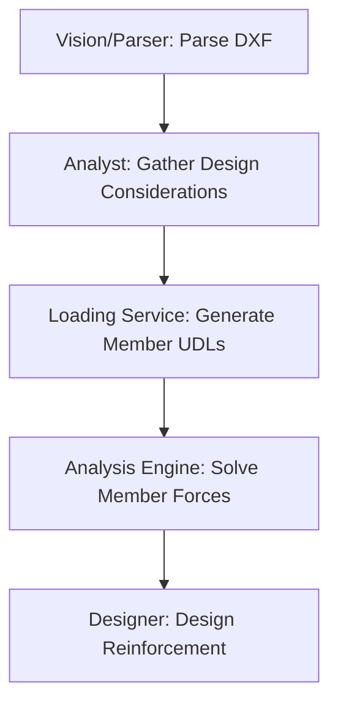
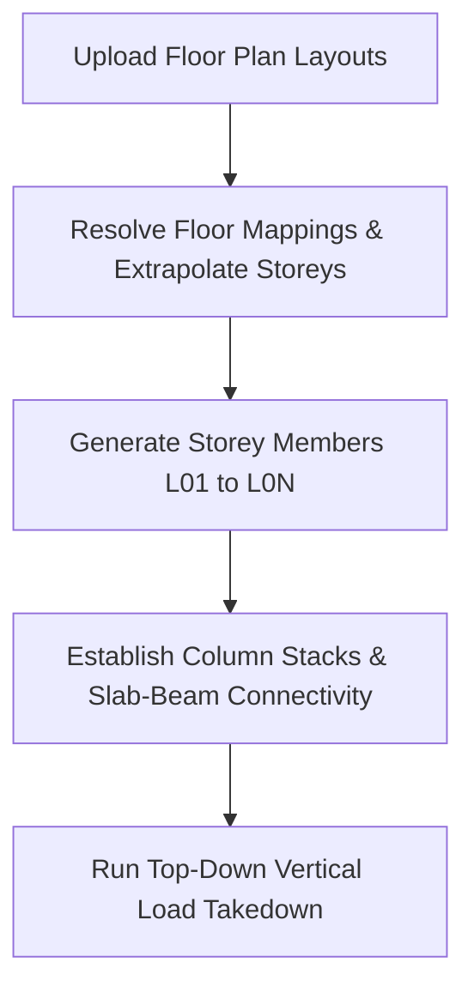
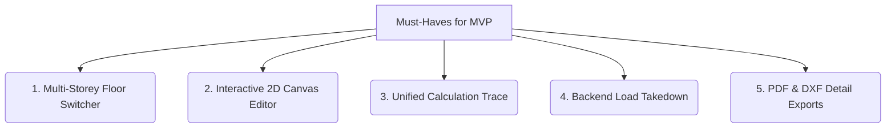

# Technical Audit: Loading & Analysis Engine

This document summarizes the analysis, identified architectural gaps, and proposed resolution steps for the loading and analysis modules of the **AI-Driven Structural Design Copilot**.

---

## 1. Context & Core Workflow

The structural engineering pipeline processes architectural geometry and loading criteria through the following stages:

### A. Design Considerations & Loading
* **Considerations Questionnaire:** Parameters like `num_storeys`, `storey_height_m`, and dead/imposed loads are collected via the interactive chat panel.
* **UDL Assembly:** The loading service computes area loads and factors them based on the design code:
  * **BS 8110:** $1.4 G_k + 1.6 Q_k$
  * **Eurocode 2:** $1.35 G_k + 1.5 Q_k$
* **Slab-to-Beam Transfer:** Slab area loads are converted into equivalent linear UDLs on supporting beams using yield-line theory (one-way vs. two-way distributions).

### B. Vertical Member Reductions
* To account for the improbability of all floors being fully loaded simultaneously in multi-storey buildings, [vertical_loaders.py](file:///home/adehnaija/Documents/projects/design-suite/apps/api/core/loading/vertical_loaders.py#L20-L36) computes imposed load reduction factors based on the number of storeys supported.

---

## 2. Identified Implementation Gaps

During our analysis of the loading and analysis pipeline, four critical gaps were identified:

### Gap 1: Isolated Beam Segment Parsing (Simply Supported Fallback)
* **The Issue:** The geometry parser ([extractor.py](file:///home/adehnaija/Documents/projects/design-suite/apps/api/core/parsing/extractor.py#L656-L657)) extracts each beam line segment between columns as an independent single-span member (`spans_m = [l_clear]`).
* **Impact:** 
  * The analysis engine routes these segments to the `SimplySupportedBeamSolver`.
  * Physical continuity is ignored, resulting in zero hogging moments over interior column supports and overestimated deflection.
  * Clicking a segment in the UI (e.g. `1B40` in the screenshot) only shows the analysis for that 1.99 m segment instead of the continuous run.

### Gap 2: Missing Top-Down Load Takedown
* **The Issue:** Column forces are stubbed with default placeholders (e.g., `N_uls = 1000.0`, `M_uls = 0.0`) in [extractor.py](file:///home/adehnaija/Documents/projects/design-suite/apps/api/core/parsing/extractor.py#L478-L479) and resolved in isolation in `engine.py`.
* **Impact:** There is no vertical load path tracking to accumulate floor loads from upper storeys down to the foundation.

### Gap 3: Ignored Storeys Parameter in Loading Service
* **The Issue:** The `loading_service` combinations engine does not consume the project-wide `num_storeys` parameter when factoring member loads.

### Gap 4: Missing Wall Live Load Reduction
* **The Issue:** While columns receive live load reductions, [WallLoadAssembler](file:///home/adehnaija/Documents/projects/design-suite/apps/api/core/loading/vertical_loaders.py#L83-L114) factors wall loads with unreduced imposed loads, violating code allowances.

---

## 3. Proposed Solution: Multi-Storey Extrapolation & Member Generation

To support vertical load takedown in a project where only typical floor plans are uploaded, the backend normalizer should **extrapolate the 3D member topology** based on the `num_storeys` parameter before calculating member loads:

### A. Floor Plan Input Strategies
If the building has different layouts for each floor (e.g. Ground Floor is different from Floor 1), the system enforces the following input standard:

* **Multi-Layout Tabs Requirement:** The engineer must place each floor layout on its own DXF Layout tab (e.g., `Ground Floor`, `First Floor`).
  * **How it works:** `ezdxf` reads each layout separately. Coordinates overlap perfectly (Column C1 is at $(10, 12)$ on both tabs), allowing vertical column stacks to align natively without translation offsets.
  * **Model Space Draw Restriction:** Drawing multiple differing layouts side-by-side in the single Model space is not supported.

---

## 4. MVP Scoping Constraints

To ensure a fast, robust release, the visualization and interface components are scoped as follows:

* **3D Visual Rendering (Post-MVP / Phase 2):** Deferred. Interactive WebGL/Three.js viewports are secondary to core structural correctness. Detailing and verification are handled in 2D.
* **The 5 Core MVP Deliverables:**
  1. **Multi-Storey Floor Switcher:** A dropdown or tab bar above the 2D canvas to switch the active rendering plane between levels.
  2. **Interactive 2D Canvas Editor:** Clicking a beam, slab, or column opens a property inspector to override dimensions and rebar.
  3. **Unified Calculation Trace:** Step-by-step math traces showing exact substitutions and code references (BS 8110/EC2).
  4. **Backend Load Takedown:** True top-down vertical load path tracking (calculated mathematically on the backend, visible in column parameters).
  5. **PDF & DXF Detail Exports:** Generates printable PDF calculation sheets and DXF layout/rebar drawing files.

---

## 5. Step-by-Step Resolution Plan

We propose the following multi-phased implementation schedule:

### Phase 1: DXF Layout Parsing & Filtering
1. **Multi-Layout Extraction:** Configure `dxf_parser.py` to extract entities per-layout tab and attach a `layout_name` tag to raw entities.
2. **Tab Validation:** Add validation to reject uploads where different floor plans are placed side-by-side in Model space, prompting the user to arrange them in separate layout tabs.

### Phase 2: Multi-Storey Member Extrapolation & Stack Linkage
1. **Storey Member Generation:** For single-layout uploads, duplicate typical geometry for $N$ storeys.
2. **Column Stack Linkage:** Establish spatial overlap mappings between columns across storeys to create a vertical load-path hierarchy.

### Phase 3: Collinear Beam Run Sweeper
1. **Collinear Detection:** Group collinear, contiguous beam segments on each level into single multi-span beam members with a list of span lengths: `spans_m = [L1, L2, L3]`.

### Phase 4: Continuous Beam Solver Integration
1. **Router Update:** Update `AnalysisEngine._route_beam` in [engine.py](file:///home/adehnaija/Documents/projects/design-suite/apps/api/core/analysis/engine.py#L43-L74) to route all grouped multi-span beams to `MomentCoefficientSolver`.
2. **Frontend Sync:** Ensure selection and rendering display the entire multi-span BMD/SFD on the Canvas.

### Phase 5: Vertical Load Takedown Engine
1. **Takedown Algorithm:** Implement a top-down accumulation engine:
   * Calculate slab-to-beam reactions.
   * Transfer beam reactions as concentrated loads to supporting columns.
   * Accumulate column axial loads storey-by-storey down to the foundations, applying the live-load reduction factors based on storeys supported.

### Phase 6: Wall Load Reduction Alignment
1. Update `WallLoadAssembler.assemble_wall_load` to integrate `get_load_reduction_factor` based on the number of storeys supported by the wall.

