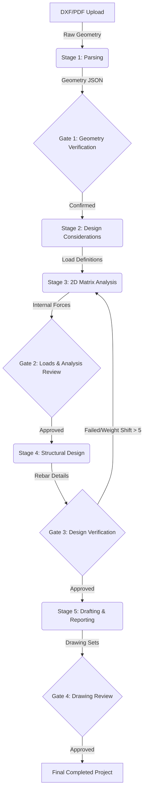

# Pipeline Architecture: AI-Driven Structural Design Copilot

This document specifies the pipeline architecture, data schema flows, safety gate checkpoints, and execution controls of the structural engineering design copilot.

---

## 1. Architectural Overview & Topology

The system is designed as a **hybrid orchestration platform** combining a **StateGraph-driven conversational supervisor** (managing human-in-the-loop gates and AI narrative generation) with a high-performance **REST-based calculation engine** (handling structural analysis, matrix solving, and code checks).

---

## 2. Pipeline Stages & Data Flow

### Stage 1: Vision & Parsing (The "Eyes")
* **Inputs:** Client DXF vector drawings and PDF reference elevations.
* **Process:** 
  1. Deterministic geometry extraction via `ezdxf` reads layers, lines, and blocks.
  2. LLM-based vision extraction parses columns, structural slabs, and openings.
  3. Resolution of units (automatic millimeter override to safeguard against scale errors).
* **Outputs:** `Structural Geometry JSON` stored in `StageResultStore`.
* **Controls & Safety Gate 1 (`geometry_verified`):** 
  * The state machine halts and enters an `interrupt_before` state at `geometry_gate`.
  * The user must review the parsed components on the Interactive Canvas and click **Confirm Geometry** to advance.

### Stage 2: Design Considerations & Loading Setup
* **Inputs:** Confirmed geometry layout.
* **Process:** 
  1. The `Analyst Agent` prompts the user with a dynamic questionnaire (based on the project's selected design code, e.g., BS 8110 or Eurocode 2) to collect load cases, building type, and exposure conditions.
  2. The service tier validates inputs and builds load cases (dead, live, wind combinations).
* **Outputs:** `Load Definition JSON` containing parameters and combinations coefficients.

### Stage 3: Matrix Analysis (Global Physics)
* **Inputs:** Geometry data + Load definitions.
* **Process:**
  1. Calls the `AnalysisEngine` (2D Euler-Bernoulli frame solver).
  2. Calculates support reactions, nodal displacements, and members internal force envelopes (Shear $V$, bending moment $M$, axial force $N$).
* **Outputs:** `Analysis Results JSON` with moment/shear envelopes and structural calculation traces.
* **Controls & Safety Gate 2 (`loading_confirmed`):** 
  * Bypassing is protected; the project status database is updated to `ANALYSIS_COMPLETE`.
  * The state machine pauses, requiring verification of the load takedown values before initiating code-checks.

### Stage 4: Structural Design (Local Material)
* **Inputs:** Internal forces envelopes + Code parameters (BS 8110 / EC2).
* **Process:** 
  1. Performs iterative reinforcement calculations (effective depth, main steel area, shear link size, spacing).
  2. Compiles code-compliance checks (e.g., maximum deflection limits, spacing regulations, utilization checks).
* **Outputs:** `Design Results JSON` containing rebar schedules, utilization rates, and detailed calculation traces.
* **Controls & Safety Gate 3 (`design_confirmed`):**
  * **The Convergence Loop:** If any member's self-weight changes by more than **5%** due to resized sections or rebar mass, the designer triggers a re-analysis loop, returning to Stage 3 to ensure structural equilibrium.
  * Halts at `design_gate` to allow engineers to apply direct section overrides.

### Stage 5: Drafting & Reporting (The "Hands")
* **Inputs:** Rebar schedule + Design calculations.
* **Process:**
  1. Generates 2D elevations, schedules, and cross-sections coordinates for rendering via HTML5 Canvas.
  2. Bundles equations and calculation traces into print-friendly PDF or HTML calc sheets.
* **Outputs:** Drawing sets and compliance reports.
* **Controls & Safety Gate 4 (`drawing_confirmed`):** Final sign-off gate before exporting completed drawings to production.

---

## 3. Core Constraints & Controls

### I. Safety Gate State Matrix
| Gate Name | Backend State Flag | Required Project Status (DB) | Action Prior to Gate | Transition Condition |
| :--- | :--- | :--- | :--- | :--- |
| **Geometry Gate** | `geometry_verified` | `GEOMETRY_VERIFIED` | Verify layout coordinates | User confirms parsed layout on Canvas |
| **Loading Gate** | `loading_confirmed` | `LOADING_DEFINED` | Define loads/combinations | User approves load cases |
| **Design Gate** | `design_confirmed` | `DESIGN_COMPLETE` | Check rebar schedule & utility | User signs off reinforcement design |
| **Drawing Gate** | `drawing_confirmed` | `REPORT_GENERATED` | Review final structural sheets | User signs off drawing output |

### II. State Reconnect & Healing Protocol
To prevent "split-brain" bugs (where database updates occur outside LangGraph orchestration, or server restarts wipe memory checkpoints), the WebSocket connection uses a self-healing protocol:
1. Upon handshake, the server compares the database `pipeline_status_ordinal` against the checkpointer state.
2. If the checkpointer state is empty or lags, the server programmatically updates the checkpointer state to align with the database, reconstructs missing agent narration (e.g., generating the analysis summary narrative), writes the checkpoint with `as_node` pointing to the corresponding agent, and resumes the graph to block precisely at the next pending gate.

### III. Execution Restrictions
* **Pipeline Integrity**: Endpoints must not run a full analysis or design run independently of the LangGraph state machine. This ensures that checkpointer snapshots remain complete and synchronized.
* **Granular Edits**: HTTP endpoints (e.g., `/api/v1/design/{project_id}/member/{member_id}`) are restricted to processing single-member re-runs or designer overrides, which trigger convergence warnings without skipping upstream steps.
