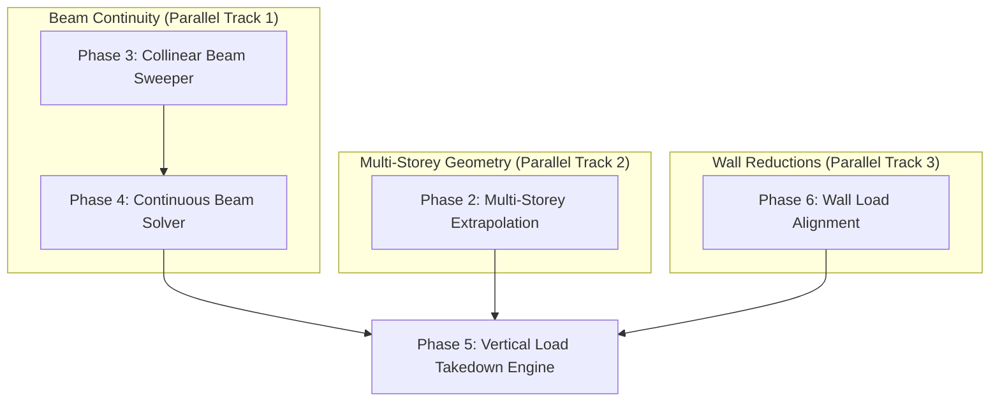

```mermaid
graph TD
    subgraph Track A: ["Beam Continuity (Parallel Track 1)"]
        P3[Phase 3: Collinear Beam Sweeper] --> P4[Phase 4: Continuous Beam Solver]
    end

    subgraph Track B: ["Multi-Storey Geometry (Parallel Track 2)"]
        P2[Phase 2: Multi-Storey Extrapolation]
    end

    subgraph Track C: ["Wall Reductions (Parallel Track 3)"]
        P6[Phase 6: Wall Load Alignment]
    end

    P4 --> P5[Phase 5: Vertical Load Takedown Engine]
    P2 --> P5
    P6 --> P5
```
